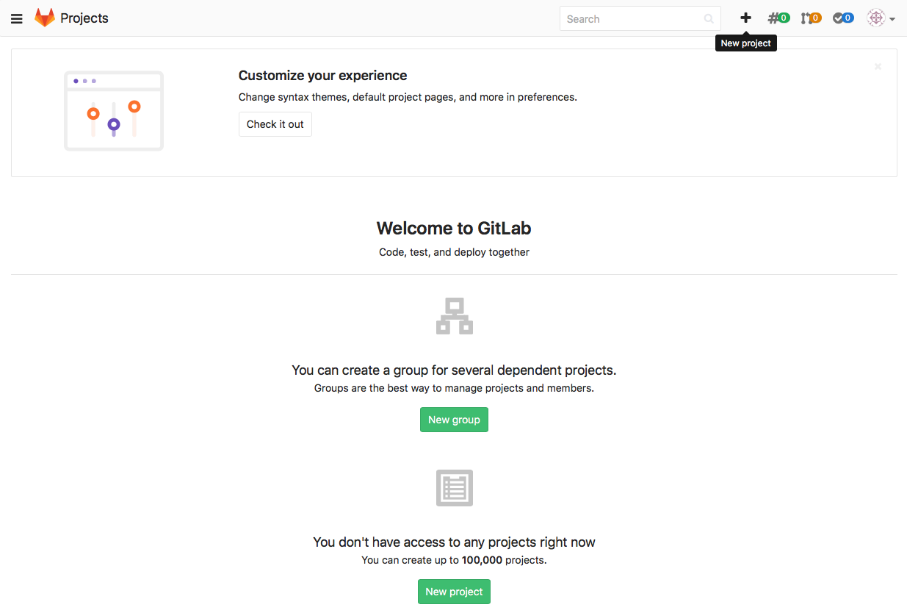
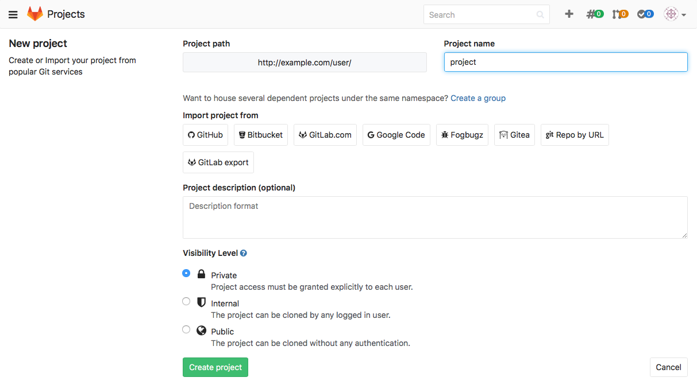
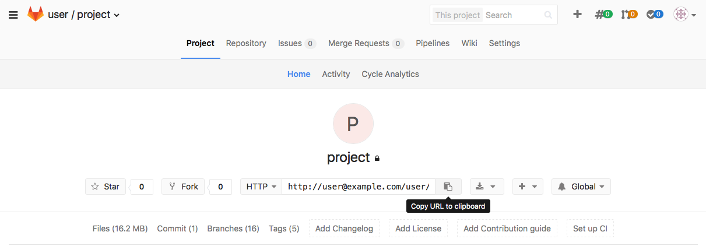

## SubGit IMPORT to GitLab

1. Configure GitLab server:

    - Log in to GitLab web GUI and create a new project:

        

        Give a name to your project and click **Create project** button.

        

    - Login to the GitLab server (over ssh or to the local console) and install JRE:

        - for CentOS 6/7:

                $ sudo yum install java

        - for Debian and Ubuntu:

                $ sudo apt-get install default-jre

        - for OpenSUSE:

                $ zypper in java-1_8_0-openjdk

    - install SubGit binary:

        - On CentOS and OpenSUSE Linux download universal **subgit-3.2.4.zip** binary:

            https://subgit.com/download/subgit-3.2.4.zip

            and unzip it:

                $ unzip subgit-3.2.4.zip

        - on Debian and Ubuntu download Debian package:

            https://subgit.com/download/subgit_3.2.4_all.deb

            fetch missing dependencies and install:

              $ sudo dpkg -i subgit_3.2.4_all.deb
              $ sudo apt-get install -f

2. Configure the repository:

    - Change identity to 'git' user:

            su git

    - Change directory to that one that contains the newly created project. GitLab usually stores its project in

            /var/opt/gitlab/git-data/repositories/<username>

        *username* here is actual GitLab user name that was used during the project creation on step 1.
        Step into that directory:

            $ cd /var/opt/gitlab/git-data/repositories/user

        New GitLab project we have created in step 1 is being stored here in the directory of the same name we named the project:

            $ ls -l
              total 0
              drwxrwx---. 6 git git 131 apr 25 02:06 project.git
              drwxrwx---. 6 git git 131 apr 25 02:06 project.wiki.git

    - Run this command to configure SubGit import:

            $ /temp/subgit-3.2.4/bin/subgit configure --layout auto --trunk trunk SVN_URL GIT_REPO

       > **To be added into pop-up cloud (when hovering on SVN_URL and GIT_REPO):**
       >
       > **SVN_URL** - URL to the SVN project.
       >
       > **GIT_REPO** - path to new Git repository where data from the SVN project will be imported to.

       ***see command example --> (to be placed in drop-down block):***

            $ /tmp/subgit-3.2.4/bin/subgit configure --layout auto --trunk trunk http://svn.example.com/svn/repository/project ./project.git

            SubGit version 3.2.4 ('Bobique') build #3670

            Configuring writable Git mirror of remote Subversion repository:
                Subversion repository URL : http://svn.example.com/svn/repository/project
                Git repository location   : ./project.git

            Git repository is served by GitLab, hooks will be installed into 'custom_hooks' directory.

            Detecting peg location...
            Authentication realm: <http://svn.example.com/:80> Subversion Repository
            Username [git]: user
            Password for 'user':
            Peg location detected: r48 project/trunk
            Fetching SVN history... Done.
            Growing trees... Done.
            Project origin detected: r1 project/trunk
            Building branches layouts... Done.
            Combing beards... Done.
            Generating SVN to Git mapping... Done.

            CONFIGURATION SUCCESSFUL

            To complete SubGit installation do the following:

            1) Adjust Subversion to Git branches mapping if necessary:
                /var/opt/gitlab/git-data/repositories/user/project.git/subgit/config
            2) Define at least one Subversion credentials in default SubGit passwd file at:
                /var/opt/gitlab/git-data/repositories/user/project.git/subgit/passwd
               OR configure SSH or SSL credentials in the [auth] section of:
                /var/opt/gitlab/git-data/repositories/user/project.git/subgit/config
            3) Optionally, add custom authors mapping to the authors.txt file(s) at:
                /var/opt/gitlab/git-data/repositories/user/project.git/subgit/authors.txt
            4) Run SubGit 'install' command:
                subgit install ./project.git

    - Specify authors mapping

        Update GIT_REPOS/subgit/authors.txt file or change core.authors option to point to global authors mapping

        Find more details about authors mapping in [Import book](https://subgit.com/import-book.html#20)

3. Perform import and start using new Git repository:

    - Import repository by the command:

             $ /tmp/subgit-3.2.4/bin/subgit import GIT_REPO

       ***see command example --> (to be placed in drop-down block):***

            $ /tmp/subgit-3.2.4/bin/subgit import ./project.git

            SubGit version 3.2.4 ('Bobique') build #3670

            Authentication realm: <http://svn.example.com:80> Subversion Repository
            Username [git]: user
            Password for 'user':

            Translating Subversion revisions to Git commits...

                Subversion revisions translated: 48.
                Total time: 38 seconds.

            IMPORT SUCCESSFUL

    - When the command completes, you can clone your new Git repository and start to work with it:

            $ git clone GIT_REPO WORK_TREE

        where

        **WORK_TREE** - path to your working copy.

        **GIT_REPO** - GitLab project URL:

        

        ***see command example --> (to be placed in drop-down block):***

        - on Windows:

                C:\>git clone http://user@example.com/user/project.git ./project.git
                Cloning into './project.git'...
                remote: Counting objects: 99, done.
                remote: Compressing objects: 100% (39/39), done.
                remote: Total 99 (delta 50), reused 99 (delta 50)
                Unpacking objects: 100% (99/99), done.

        - on Linux/MacOS X:

                $ git clone http://user@example.com/user/project.git ./project.git
                Cloning into './project.git'...
                Password for 'http://user@example.com':
                remote: Counting objects: 99, done.
                remote: Compressing objects: 100% (39/39), done.
                remote: Total 99 (delta 50), reused 99 (delta 50)
                Unpacking objects: 100% (99/99), done.

Note: no license key required for import!

Would you have any assistance, don't hesitate to contact us at support@subgit.com